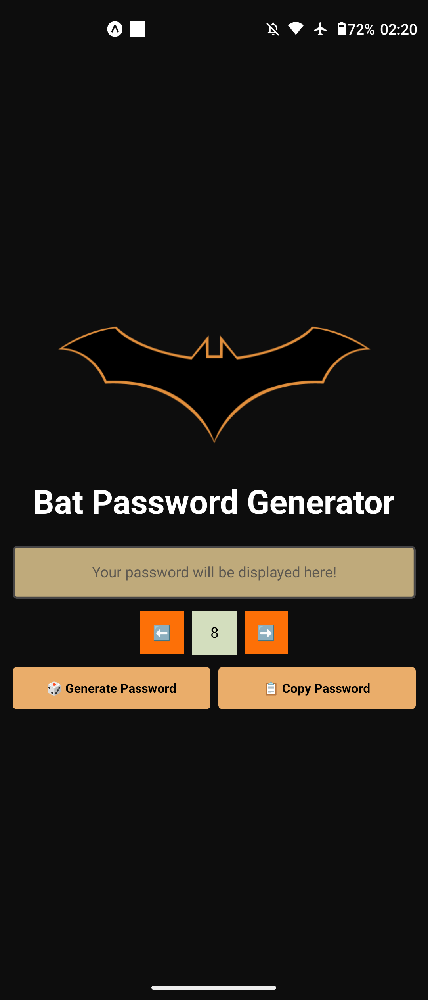

# 🦇 Bat Pass Generator

O objetivo do desafio é criar um app gerador de senhas aleatórias utilizando o **Expo**.

---

## 📸 Imagem

<a href="#">
    
</a>

---

## 📌 O que o app deve fazer

- [x] **Permitir gerar uma senha forte** com caracteres aleatórios, incluindo números e caracteres especiais
- [x] **Permitir o usuário copiar a senha** gerada para a área de transferências

---

## 🎁 Bônus

- [x] **Permitir o usuário selecionar o tamanho** da senha gerada

---

## 🚀 Como rodar o projeto

```bash
git clone https://github.com/Jef-RS/desafios.git
cd 7-react-native-password-generator/password-generator
npm install
npm start
```
