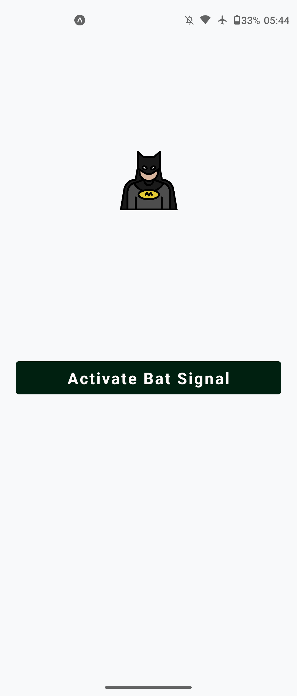
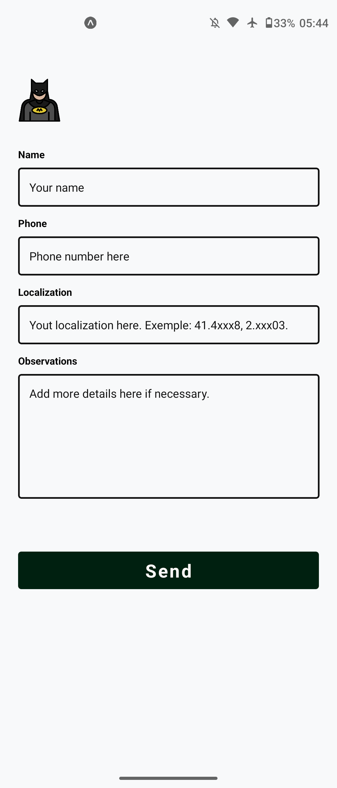

## 🦇 Bat Sinal

O objetivo desenvolver a interface mobile de um aplicativo de Bat-Sinal usando React Native, o app deve conter apenas uma tela na qual deve ter um botao que leve o usuario para um formulario quando clicado

#### 📸 Imagens

<a href="#">
    
    
</a>

## 🚀 Como rodar o projeto

```bash
git clone https://github.com/Jef-RS/desafios.git
cd 8-react-native-bat-sinal/my-app
npm install
npm start
```
